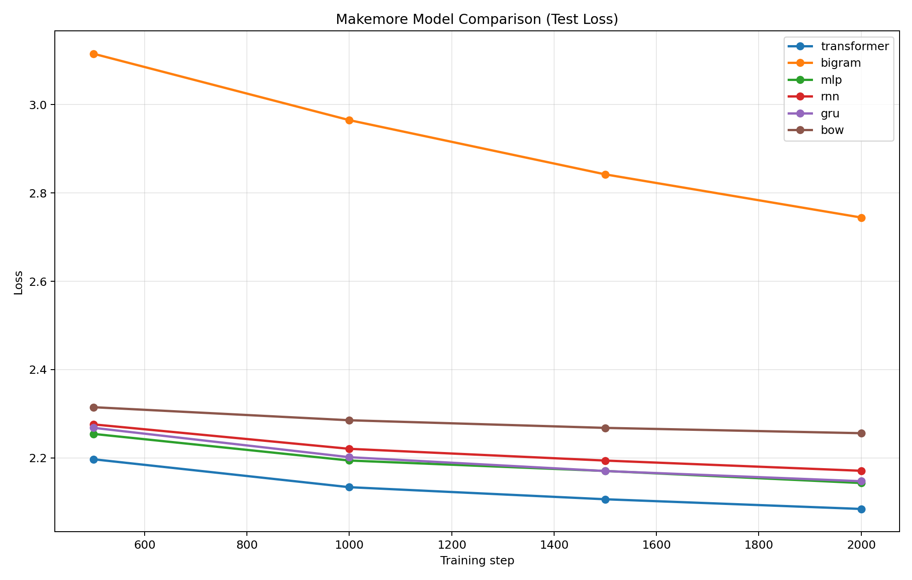

# makemore-from-scratch

This repository is a from-scratch implementation of multiple character-level language model architectures, inspired by makemore, with the main goal of understanding each architecture deeply by building it manually.

## Main Purpose

The core purpose of this repo is not only to train models, but to implement each model architecture from scratch and compare how they behave on the same task.

Implemented architectures:

- Transformer
- Bigram
- MLP
- RNN
- GRU
- Bag of Words (BoW)

## What Is Included

- Character-level data pipeline from names.txt
- Training and sampling pipeline in one script
- Multiple model implementations in the same codebase for direct comparison
- Automated comparative study runner for reproducible experiments

## Comparative Study (my_comparison)

Comparison plot (test loss across training):



Full generated artifacts:

- Report: [comparative_runs/my_comparison/comparison_report.md](comparative_runs/my_comparison/comparison_report.md)
- Loss table: [comparative_runs/my_comparison/loss_records.csv](comparative_runs/my_comparison/loss_records.csv)
- Raw summary JSON: [comparative_runs/my_comparison/summary.json](comparative_runs/my_comparison/summary.json)

## Key Comparison Results

Final test loss at step 2000:

| Rank | Model       | Test Loss |
|------|-------------|-----------|
| 1    | transformer | 2.0846    |
| 2    | mlp         | 2.1433    |
| 3    | gru         | 2.1473    |
| 4    | rnn         | 2.1710    |
| 5    | bow         | 2.2560    |
| 6    | bigram      | 2.7443    |

Key points:

- Transformer achieved the best final loss in this run.
- MLP, GRU, and RNN are relatively close, with GRU slightly outperforming vanilla RNN.
- BoW performs reasonably but lags sequence-aware neural models.
- Bigram is the weakest baseline, as expected from its limited context modeling.

## Sample Outputs Snapshot

Examples extracted from comparison_report.md:

| Model | Seen-in-train examples | New generated examples |
|------|-------------------------|------------------------|
| transformer | dariana, nix, mariyah | riyaansta, telanie, baytro |
| bigram | bill, kylyn | juxn, avtzeliqua, vykunromadazeis |
| mlp | keilan, jaxlyn, jo | alifa, keidi, merray |
| rnn | rya, lyon, laya | abregenligh, diand, zanchi |
| gru | mary, lady, jovey | chemicea, rojevi, mitzell |
| bow | dani, kiyan, jad | luck, braghi, geshya |

## Run Your Own Comparative Study

Run from the makemore folder:

```powershell
python run_comparative_study.py --max-steps 2500 --device cpu
```

Useful options:

- --study-name my_run_name
- --models transformer bigram mlp rnn gru bow
- --input-file names.txt
- --python-executable C:/Users/umutk/AppData/Local/Programs/Python/Python312/python.exe